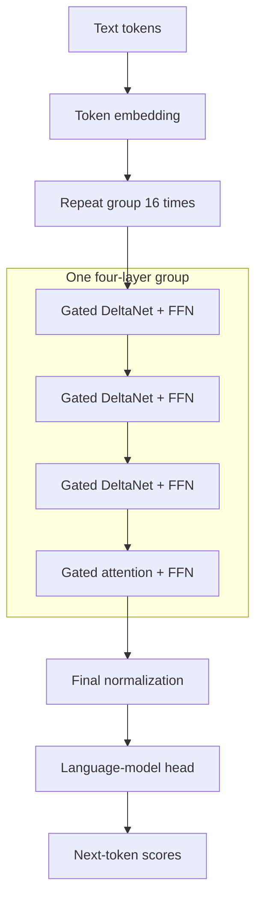
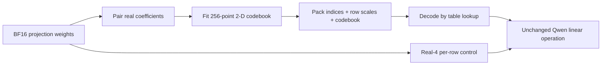

# Architecture: paired weight codes and calibration (both hypotheses retired)

This note describes what this repository actually builds and measures. It
replaced an earlier version organized around a polar (magnitude/phase) weight
code; Section "Why the polar code was dropped" records that result rather than
deleting it.

## Current low-rate implementation

The revised experiment in `paper/ternary_proposal.md` quantizes the 18
DeltaNet QKV input projections of the 24-layer Qwen3.5-0.8B-Base checkpoint.
`experiments/lowrate_codec.py` supplies three distinct representations:
literal scaled ternary, a learned three-level scalar code, and a shared
6,561-entry eight-dimensional vector codebook. Vector components are learned
real values, so the third representation is not a ternary-weight model.

The data path is: frozen weights, fixed signed block-Hadamard transform,
FP16 group scales, quantizer fitting and FP16 codebook rounding, packed indices,
then serialization. The evaluation path reloads those files, reconstructs
weights, inverts the rotation and installs BF16 weights in the original linear
modules. Model forward semantics remain unchanged apart from quantization
error. Every retained block loss and target count contributes to the final
validation metric, including the final short block.

Measured codec bytes include shared codebooks once, every scale and index,
rotation information and headers. Report this rate only for the encoded
projections; the rest of the checkpoint remains BF16. The scalar g64 control
has a larger storage allowance than shared VQ8 g128, so the primary claim is
quality at no greater storage, not exact byte equality. Runtime evaluation is
still dense BF16: speed and GPU-memory benefits of packed inference remain
unmeasured. A 27B implementation requires a separate streaming or packed
runtime; a six-GB compressed file does not make its fully decoded weights fit.

The following sections retain the prior four-bit architecture and findings.

## Target models

Experiments use the **text path** of frozen Qwen checkpoints. Qwen3.5-0.8B-Base
is the working checkpoint; Qwen3.5-2B-Base is an explicit negative-control
checkpoint; Qwen3.8-27B is used for shard-local weight analysis only. The
official Qwen3.8-27B checkpoint is multimodal, but our experiments load its
causal language model and use WikiText-2 text only. Per the
[official model card](https://huggingface.co/Qwen/Qwen3.8-27B), its 64 language
layers repeat a four-layer pattern 16 times: three Gated DeltaNet blocks, then
one gated full-attention block, each with an FFN. The diagram abstracts residual
paths, normalization, gating, and the vision encoder.

DeltaNet is a recurrent, linear-attention-style memory: instead of retaining
every earlier token in a KV cache, it updates a fixed-size state mapping key
features to value features, correcting what the state predicts for the current
key. Gated DeltaNet adds a learned retention gate. See the
[DeltaNet](https://arxiv.org/abs/2406.06484) and
[Gated DeltaNet](https://arxiv.org/abs/2412.06464) papers.

## The weight codec

We pair two real weights per code and spend **8 index bits per pair** = 4 bits
per real weight, matching a real-4 control exactly. A tensor stores:

* 8 index bits per pair,
* one FP32 scale per output row,
* a per-tensor codebook header (256x2 FP32 = 2 KB for the 2-D code).

Against a 6144x1024 projection the largest header (the 2-D codebook) is
2.6e-3 bits per weight, or 0.065% of the four-bit index budget; the scalar and
polar headers are ~30x smaller again. The comparison is byte-matched to within
rounding.

Decoding is a 256-entry lookup, not a sine/cosine evaluation. This matters:
the earlier polar decoder needed trigonometry per pair, which is why the packed
Triton kernels ran 3-4.5x slower than resident BF16.

Implementation: [`experiments/vq_codec.py`](experiments/vq_codec.py). The polar
codec and its Lloyd-fitted repair are retained for comparison in
[`experiments/polar_codec.py`](experiments/polar_codec.py).

## Self-consistent quantization (SCQ) — retired

This section previously described an SCF loop, by analogy with Kohn-Sham DFT,
for the fixed point `Q* = Quantize(H[Q*])`. **The direction is retired.** Three
measurements closed it; raw data in `results/scf_phase0_v1/`,
`results/fisher_diagnostic_v1/`, `results/protect_full_v2/`.

**1. The forward-only problem is acyclic, so iteration is the wrong tool.**
`H_l` depends only on layers before `l`, so quantizing in topological order
while propagating quantized activations reaches the fixed point in *one sweep*.
Two published methods already exploit this in closed form -- GPTAQ's asymmetric
calibration ([2504.02692](https://arxiv.org/abs/2504.02692)) and CoreQ's
mismatch correction ([2602.05902](https://arxiv.org/abs/2602.05902)). On a
32,768-target screen the one-pass arm beat our iteration by 0.004228 NLL.
Damping -- what makes SCF stable in DFT -- is what makes it wrong here, because
the mixed statistic corresponds to no actual model state.

**2. Solving it correctly does not help much at this scope either.** On the
complete validation stream, sequential calibration changes the Lloyd scalar code
by +0.000022, leaves decoupled polar bit-identical (it ignores statistics),
improves repaired polar by -0.000596, and *worsens* the 2-D codec by +0.000607.
The forward statistics move only 0.87% when input projections in 18 of 24 layers are quantized (15.1% of parameters), so
there is little to recover. Expect this to matter more under whole-model
quantization, which we did not run.

**3. The bidirectional reformulation identifies a real coupling that does not
convert into a method.** The second-order per-layer cost factorizes as
`sum_j S_j * dw_j^T H^xx dw_j` with `S_j = E[(dL/dy_j)^2]`; `H^xx` depends on
upstream layers and `S` on downstream ones, so the graph *is* cyclic and
iteration *is* forced. The backward residual is 7.33% against the forward
0.87% -- 8.41x larger. But Fisher-weighted error has no rank skill across
layers (Spearman +0.015; its Pearson of 0.898 collapses to 0.181 once a single
leverage point is removed), and its one correct call does not beat spending the
same bytes uniformly (see below).

### The one finding worth keeping

Layer 0 is simultaneously the most damaging layer to quantize, the layer Fisher
ranks highest, and the layer **weight MSE ranks as the safest of all 18**. It
alone is 58.2% of summed single-layer damage. That is a concrete mechanism for
this project's recurring observation that weight MSE does not predict task loss.
It is not exploitable: protecting it recovers ~56% of the damage at 1.167x
payload, while simply using a larger codebook everywhere recovers more at
comparable cost.

## Why the polar code was dropped

The earlier design stored a 3-bit magnitude and a 5-bit phase per pair, and an
earlier draft reported it beating an equal-byte real-4 control on Qwen3.5-0.8B.
Three measurements retired that line of work.

1. **The control was weak.** The real-4 control used a *uniform* 16-level
   codebook, while a radius grid crossed with a phase grid is not a square
   lattice. Giving the scalar control the same per-tensor Lloyd-Max fitting
   reverses the ranking on all six tensors measured and on the full WikiText-2
   validation stream.
   [`results/codebook_ceiling_v1`](results/codebook_ceiling_v1/summary.md)

2. **Repairing the assignment rule barely helps, for a computable reason.** The
   original quantizer rounded magnitude and phase independently, which is not
   nearest-neighbour assignment in the 8x32 codebook: the optimal radius level
   is nearest the *projection* `r cos(d)` onto the chosen phase ray, not nearest
   `r`. Exact nearest-neighbour search over all 256 codepoints improved weight
   MSE by 0.035%. With five phase bits, `|d| <= pi/32`, so
   `1 - cos(d) <= 4.8e-3` -- the correction is at most half a percent of the
   radius, while one step of the 3-bit radius grid is about 14% of the row
   scale. This retrospectively explains a long series of null results in this
   project: learned phase offsets, activation-weighted phase choice, and
   output-error phase selection were all tuning a quantity bounded to be small.
   The binding constraint is the radius grid.
   [`results/polar_codec_ablation_v1`](results/polar_codec_ablation_v1/summary.md)

3. **The family is structurally capped.** After exact nearest-neighbour
   assignment, a Lloyd-fitted radius grid, and a sweep over every
   magnitude/phase bit split (8x32 is optimal; moving bits to the phase is
   catastrophic), polar still sits 6-8% above the fitted scalar code. An
   unconstrained 256-point 2-D codebook -- which lower-bounds *every* paired
   8-bit code -- sits 18-24% *below* it. The pairing idea was right; the polar
   parameterization was not.

Polar notation is also not novel, and is not a quantum result: a complex
multiplication by `rho * exp(i phi)` is exactly the real 2x2 rotation block
`rho [[cos, -sin], [sin, cos]]`. No quantum hardware was used and no quantum
advantage is claimed. The earlier Bloch-sphere framing carried no technical
weight and has been removed from the paper.

## What is and is not measured

* **Measured:** weight reconstruction error at matched byte budgets; held-out
  NLL on the complete WikiText-2 validation stream with paired block bootstraps;
  SCF convergence traces (energy, residual, assignment churn, rejected steps).
* **Not measured:** inference latency or end-to-end memory. Task-quality
  evaluation decodes candidate weights to BF16 and uses ordinary BF16 matrix
  multiplies, so storage reduction does **not** yet imply a runtime win. A
  lookup-table decoder should be far friendlier to a fused kernel than the old
  trigonometric one, but that kernel has not been written or benchmarked.
* **Not measured:** whole-checkpoint compression. Only the 18 DeltaNet input
  projections are replaced; all other weights stay BF16.
* **Controls:** GPTQ- and AWQ-style baselines are local implementations, because
  production backends do not expose Qwen3.5's custom DeltaNet projections.

## Next experiments

1. **Fused lookup-table kernel.** The decode side is now a 256-entry table that
   fits in shared memory. Benchmark decode-plus-GEMM against resident BF16 and
   against the old polar kernel, at batches 1/16/128.
2. **Whole-model quantization.** The self-consistency gap should grow with the
   number of replaced layers; the 18-projection setting is a lower bound on the
   effect. Quantize attention and MLP projections too.
3. **Richer statistics.** We currently mix a diagonal second moment. Block or
   full Hessians are a closer analogue of the DFT density and may change both
   the fixed point and the convergence rate.
4. **Anderson acceleration.** Implemented but not yet the default; measure
   whether it reduces iteration count without raising the rejection rate.
5. **Second checkpoint and corpus.** Replicate on Qwen3.5-2B (the known negative
   checkpoint) and on TinyStories under the matched all-token protocol, since
   earlier phases showed rankings can reverse across both axes.
